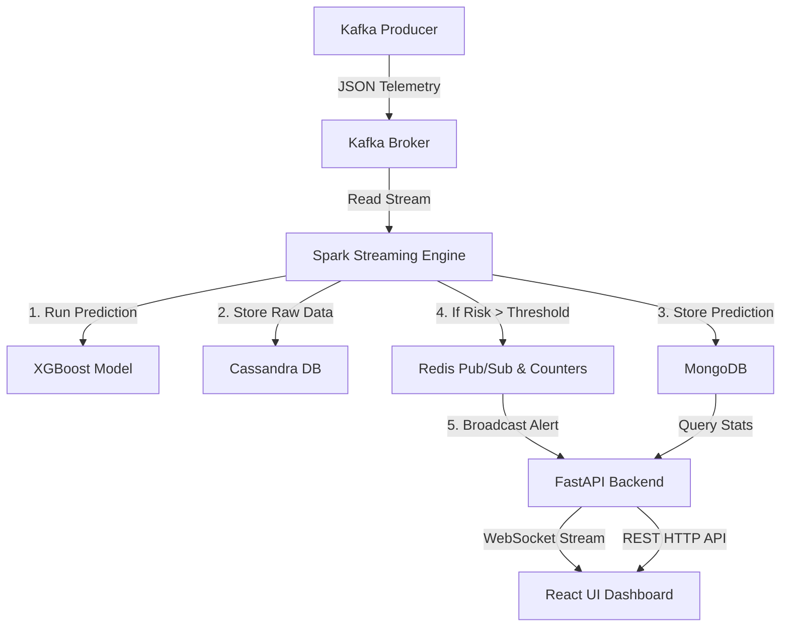

# Cyber Threat Intelligence Platform (CTIP)

An end-to-end, containerized, real-time cyber intrusion detection and threat monitoring dashboard. This platform leverages PySpark structured streaming, a distributed machine learning model (XGBoost), message queuing (Kafka), databases (MongoDB & Cassandra), caching (Redis), a FastAPI backend, and a responsive glassmorphic React frontend to monitor network flows and detect threats in real-time.

---

## 🎯 Project Objective

The primary objective of the **Cyber Threat Intelligence Platform** is to ingest, classify, analyze, and visualize high-velocity network flow telemetry in real-time to detect cyberattacks. The platform is designed to:
1. **Detect Intrusion Categories**: Classify network flows into specific attack types (e.g., DoS/DDoS, BruteForce, WebAttack, Botnet, Reconnaissance, Infiltration, Heartbleed, or Normal traffic) using a trained **SparkXGBClassifier** model.
2. **Perform Real-Time Stream Processing**: Process streaming JSON event payloads with PySpark Streaming over Kafka.
3. **Trigger Instant Alerts**: Flag high-risk events (based on dynamic risk scoring and model confidence thresholds) and push them live to security analysts via WebSockets.
4. **Aggregate Dashboard Statistics**: Compute historical attack volume trends, source IP rankings, and percentage breakdowns to provide a comprehensive security posture overview.

---

## 🏗️ Architecture & Component Roles



* **Data Generator (`kafka-producer`)**: Simulates live network traffic by reading historical holdout datasets and sending them to Kafka.
* **Message Broker (`kafka`, `zookeeper`)**: Manages the `network-telemetry` topic for low-latency ingestion.
* **Processing & Inference Engine (`spark-streaming`, `spark-master`, `spark-worker`)**: Coordinates PySpark Streaming, scales prediction tasks across workers, stores data, and runs XGBoost classifications.
* **Databases (`mongodb`, `cassandra`)**: 
  * **Cassandra** stores all raw network traffic logs for deep-packet audits.
  * **MongoDB** stores model predictions, classifications, and features for reporting.
* **Caching & Broker (`redis`)**: Serves as a key-value store for alerts, holds attack type counters, and handles the Pub/Sub network messaging for FastAPI.
* **API Server (`backend`)**: Built with FastAPI. Serves REST endpoints for statistics and prediction records, manages active WebSocket channels, and listens to Redis Pub/Sub events.
* **Visual Dashboard (`frontend`)**: Single-page React application powered by Vite, providing modern glassmorphic UI controls, dynamic Recharts visualizations, and paginated logs.

---

## 🔄 End-to-End Operational Scenario (User Workflow)

Here is a step-by-step workflow of how the entire system behaves from ingestion to visual alert:

### 1. Starting the Infrastructure
An administrator initializes all services using Docker Compose:
```bash
docker compose up -d
```
All database configurations, Kafka topics, and Spark runtimes auto-initialize. 

### 2. Simulating Malicious Traffic
The security operator starts the traffic simulator container:
```bash
docker start kafka-producer
```
The producer reads network telemetry packets (e.g. flow duration, packet lengths, protocol details) and publishes them to the Kafka queue.

### 3. Real-Time Inference (The Spark Pipeline)
* Spark Streaming pulls mini-batches of JSON network events from Kafka.
* It feeds the raw features into the loaded `SparkXGBClassifierModel` representing the pre-trained intrusion detector.
* The model produces a classification (e.g. `DoS/DDoS`) along with a probability confidence score (e.g. `0.9998` — stored as `[0, 1]`, not a percentage).
* Raw network telemetry is archived in **Cassandra** (no AI fields), and enriched intelligence predictions are written asynchronously to **MongoDB**.

### 4. Live Alert Triggering (Redis + WebSockets)
* The Spark job computes a **Risk Score** (from `0` to `100`) based on the classification and confidence level.
* If the risk exceeds the target threshold (e.g., `Risk > 80`), the Spark job writes an alert key into **Redis** (`alert:<timestamp>`) and broadcasts a payload to the Redis channel `channel:alerts`.
* The **FastAPI backend** listens to the `channel:alerts` Redis channel and receives this minimal hot-alert payload:
  ```json
  {
    "attack_type": "DoS/DDoS",
    "source_ip": "10.0.81.1",
    "risk_score": 100.0,
    "sensor_id": "sensor-01",
    "timestamp": "2026-05-21T14:20:33.412Z"
  }
  ```
* The backend immediately broadcasts this payload to all connected React clients via WebSocket connections at `/ws/live`.

### 5. Displaying Real-Time Threat Alerts on the Dashboard
* The React app, connected via a persistent WebSocket connection, receives the alert.
* The application filters out control heartbeats (`ping/pong` and connection confirmations) and extracts the payload.
* The **Live Alert Stream** card updates in real-time, popping the new alert to the top of the queue with animated visual cues:
  - **Red badge** for Critical risk (`risk > 90`)
  - **Orange badge** for High risk (`risk > 80`)
  - **Yellow badge** for Medium risk
  - **Green badge** for Low risk

### 6. Interactive Visualizations & Audits
* The user views aggregated statistics. The dashboard queries the FastAPI backend's `/statistics` endpoint.
* If the Redis cache is stale or empty, FastAPI aggregates MongoDB records dynamically:
  * **Attack Distribution (Donut Chart)**: Visualizes the percentages of detected attacks (e.g. WebAttack 16%, Botnet 16%).
  * **Attack Volume by Type (Bar Chart)**: Compares the absolute quantities of attack classes.
  * **Attack Volume Timeline (Line Chart)**: Groups event counts in 1-hour buckets across the last 24 hours to monitor trend timelines.
  * **Top Attacking IPs**: Ranks source IP addresses generating the most malicious events.
* Under **Predictions**, analysts search the database for specific source IPs, filter records by attack type, or check confidence percentages.

## 📦 Data Samples per Storage

> Each database has a distinct architectural role. Data is purposefully split to keep each store optimised for its workload.

### MongoDB (`cyber_intelligence.predictions` collection)

> **Intelligence layer** — full enriched prediction documents with AI outputs, model metadata, and a raw event snapshot.

```json
{
  "_id": "6a0f19c618ff6ecf10e12a13",
  "source_ip": "10.0.100.1",
  "predicted_attack": "Recon",
  "confidence": 0.999985,
  "risk_score": 85.99,
  "prediction_latency_ms": 42,
  "model_name": "xgboost",
  "actual_label": "Recon",
  "sensor_id": "sensor-01",
  "event": {
    "kafka_key": "part-00005-f2f2a27d-bb56-467e-bd2f-5871b42f4633-c000.snappy.parquet-649",
    "kafka_timestamp": "2026-05-21T14:42:00.119Z",
    "Destination Port": 9099,
    "Flow Duration": 57,
    "Total Fwd Packets": 1,
    "Total Backward Packets": 1,
    "Total Length of Bwd Packets": 6,
    "Label": "Recon",
    "prediction": 5
  },
  "created_at": "2026-05-21T14:42:14.423Z"
}
```

> **Key design decisions:**
> - `confidence` is stored as a probability in `[0, 1]` (ML-standard). Multiply by 100 for percentage display.
> - `risk_score` is derived: `confidence × 100 × 0.6 + severity_weight × 0.4` → result in `[0, 100]`.
> - `prediction_latency_ms` measures end-to-end Spark inference time for streaming SLA monitoring.

---

### Cassandra (`cyber_threats.attack_events` table)

> **Raw telemetry layer** — only network flow fields. No AI outputs (those belong to MongoDB).
> Partitioned by `sensor_id` for per-sensor time-series queries; clustered by `event_time DESC` for efficient latest-events retrieval.

```sql
SELECT * FROM cyber_threats.attack_events LIMIT 1;
```

Result example:

| sensor_id | event_time                       | source_ip  | destination_port | flow_duration | label     | metadata |
|-----------|----------------------------------|------------|-----------------|---------------|-----------|----------|
| sensor-01 | 2026-05-21 14:44:29.902000+0000 | 10.0.81.1  | 80              | 5799027       | WebAttack | null     |

> **Key design decisions:**
> - `attack_type` and `confidence` intentionally absent — AI outputs belong in MongoDB (intelligence layer).
> - `label` is the ground-truth dataset label, **not** an ML prediction.
> - `CLUSTERING ORDER BY (event_time DESC)` enables O(1) retrieval of the most recent events per sensor.

---

### Redis (alert keys `alert:<timestamp_ms>`, TTL = 1 hour)

> **Hot-path notification layer** — minimal ephemeral payload for real-time dashboard alerts.
> Full intelligence details are in MongoDB; Redis holds only what the live feed needs.

```json
{
  "attack_type": "Botnet",
  "source_ip":   "10.0.81.1",
  "risk_score":  100.0,
  "sensor_id":   "sensor-01",
  "timestamp":   "2026-05-21T14:40:42.635384+00:00"
}
```

> **Key design decisions:**
> - Payload is intentionally minimal (5 fields only) — Redis is in-memory; bloated payloads waste RAM.
> - TTL of `3600 s` (1 hour) is set on every key (`redis.set(key, value, ex=3600)`). Alerts self-expire.
> - Attack counters (`counter:attack_type:<type>`) are maintained separately for statistics aggregation.

These examples illustrate the exact shape of the data stored in each persistence layer, which the frontend consumes via the WebSocket and REST APIs.
