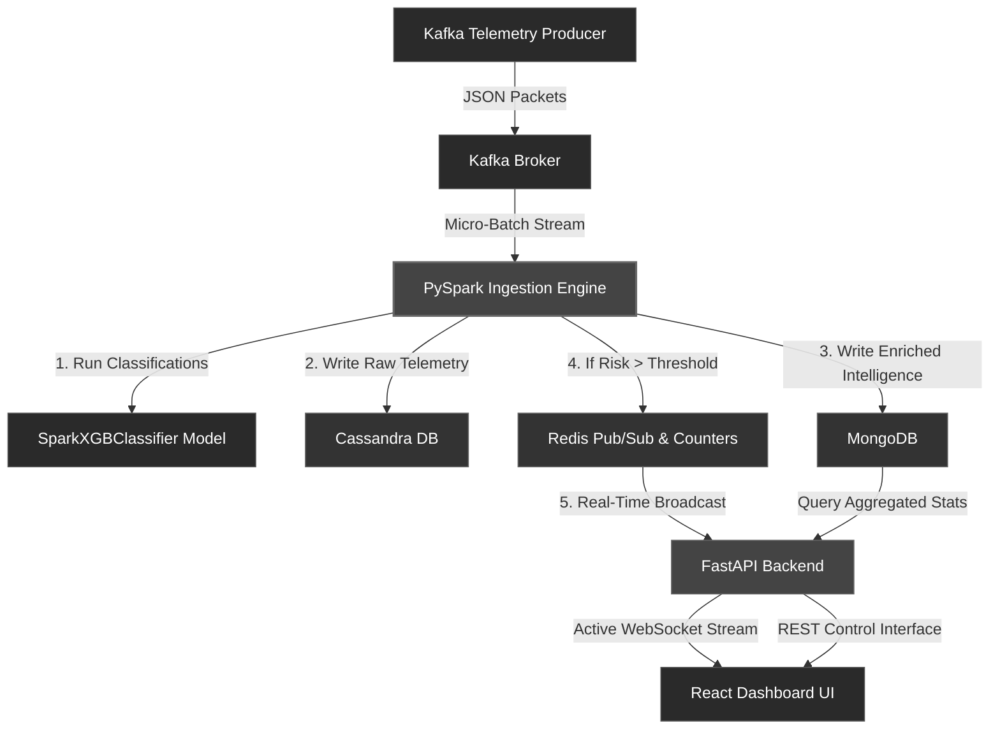

# 🛡️ Cyber Threat Intelligence Platform (CTIP)

[](https://spark.apache.org/)
[](https://xgboost.readthedocs.io/)
[](https://kafka.apache.org/)
[](https://cassandra.apache.org/)
[](https://www.mongodb.com/)
[](https://redis.io/)
[](https://fastapi.tiangolo.com/)
[](https://react.dev/)

An end-to-end, high-performance, containerized cyber intrusion detection and telemetry processing platform. 

CTIP ingests high-velocity network flow telemetry in real-time, classifies threats using a distributed **SparkXGBClassifier** model, archives raw telemetry at scale in **Cassandra**, indexes enriched intelligence in **MongoDB**, and broadcasts low-latency security alerts to a premium **glassmorphic React dashboard** via **Redis Pub/Sub** and **WebSockets**.

---

## 🏗️ Enterprise System Architecture



---

## 💾 Storage Selection & Role Rationale

To support high-velocity ingest speeds, complex analytical lookups, and sub-millisecond dashboard updates, CTIP assigns specialized roles to three distinct data layers based on their unique performance profiles:

| Database | Primary Role | Selection Justification | Allocation Details |
| :--- | :--- | :--- | :--- |
| **Cassandra** | Raw Telemetry Log | High-throughput, masterless write scalability with zero write locks. | Stores raw event telemetries indexed by sensor and time. Removed all ML attributes to act as an uncorruptible forensic log. |
| **MongoDB** | Threat Intelligence | Fast flexible nested indexing and powerful aggregation engines. | Stores enriched ML classification documents, latency histories, and aggregated attacker profile summaries. |
| **Redis** | In-Memory Alert Feeds | Sub-millisecond read/writes, pub/sub channels, and atomic counters. | Manages the live alert websocket buffer (1-hour key expiry) and powers fast threat statistics. |

---

## ⚡ Key Architectural Features & Design Decisions

### 1. Separation of Concerns (Raw Telemetry vs. Intelligence)
To maintain web-scale throughput and avoid data model corruption, CTIP separates raw telemetry from AI intelligence:
- **Cassandra (Raw Telemetry Layer)**: Pure ingestion repository. Stores unmodified network flow packets. AI properties (`confidence`, `attack_type`) are strictly excluded. Uses `PRIMARY KEY ((sensor_id), event_time)` with `CLUSTERING ORDER BY (event_time DESC)` to ensure $O(1)$ lookup speeds for the latest events on a per-sensor basis.
- **MongoDB (Intelligence Layer)**: Rich document store. Holds detailed classification outcomes, including model performance indicators, confidence levels (`[0, 1]` probability scales), prediction latencies, and attacker behavior profiles.

### 2. Live Telemetry Control Panel (Flow Ingestion Throttling)
CTIP includes an **Ingestion Command Centre** built directly into the dashboard. Security analysts can pause or launch the telemetry stream dynamically:
- Pausing sets a control state in **Redis** (`producer:status` = `"stopped"`).
- The Kafka producer queries the FastAPI backend at 100-packet intervals. Upon sensing the stop signal, it gracefully stalls in memory, standing by without dropping or dropping connections. Clicking **Launch** triggers an instant, seamless resumption.

### 3. Real-Time Risk Assessment
The PySpark pipeline derives a dynamic **Risk Score** ($0 - 100$) for every classification using a weighted formula:
$$\text{Risk Score} = (\text{Confidence} \times 100 \times 0.6) + (\text{Attack Severity Weight} \times 0.4)$$
High-risk packets exceeding the alert threshold (e.g. $\ge 80$) are buffered as ephemeral entries in Redis with a **1-hour TTL** to preserve memory, while their counts are incremented for live analytics counters.

---

## 📦 Data Schemas & Persistence Examples

### MongoDB (`cyber_intelligence.predictions`)
Enriched threat documents with complete model metadata and raw packet snapshots.
```json
{
  "_id": "6a0f19c618ff6ecf10e12a13",
  "source_ip": "10.0.100.1",
  "predicted_attack": "Recon",
  "confidence": 0.999985,
  "risk_score": 85.99,
  "prediction_latency_ms": 42,
  "model_name": "xgboost",
  "actual_label": "Recon",
  "sensor_id": "sensor-01",
  "event": {
    "kafka_key": "part-00005-f2f2a27d-bb56-467e-bd2f-5871b42f4633-c000.snappy.parquet-649",
    "kafka_timestamp": "2026-05-21T14:42:00.119Z",
    "Destination Port": 9099,
    "Flow Duration": 57,
    "Total Fwd Packets": 1,
    "Total Backward Packets": 1,
    "Label": "Recon"
  },
  "created_at": "2026-05-21T14:42:14.423Z"
}
```

### Cassandra (`cyber_threats.attack_events`)
Raw network flows optimized for time-series range queries.
```sql
SELECT * FROM cyber_threats.attack_events LIMIT 1;
```
| sensor_id | event_time                       | source_ip  | destination_port | flow_duration | label     | metadata |
|-----------|----------------------------------|------------|-----------------|---------------|-----------|----------|
| sensor-01 | 2026-05-21 14:44:29.902000+0000 | 10.0.81.1  | 80              | 5799027       | WebAttack | null     |

### Redis (`alert:<timestamp_ms>`)
Minimal lightweight payload for real-time WebSocket pub/sub distribution.
```json
{
  "attack_type": "Botnet",
  "source_ip": "10.0.81.1",
  "risk_score": 100.0,
  "sensor_id": "sensor-01",
  "timestamp": "2026-05-21T14:40:42.635384+00:00"
}
```

---

## 🛠️ Database Container Access & Query Guide

CTIP's databases are easily accessible via interactive Docker command wrappers:

### 1. 🗄️ Cassandra (Raw Ingestion Telemetry)
```bash
# Exec into container and launch CQL Shell
docker compose exec -it cassandra cqlsh

# Inspect database contents
USE cyber_threats;
DESCRIBE TABLE attack_events;
SELECT * FROM attack_events LIMIT 5;
SELECT COUNT(*) FROM attack_events;
```

### 2. 🍃 MongoDB (Threat Intelligence & ML Predictions)
```bash
# Exec into container and launch Mongo Shell
docker compose exec -it mongodb mongosh -u admin -p changeme --authenticationDatabase admin

# Query threat collections
use cyber_intelligence;
show collections;
db.predictions.find().sort({created_at: -1}).limit(1).pretty();
db.attacker_profiles.find().limit(3).pretty();
```

### 3. ⚡ Redis (Hot Caches & Live Buffers)
```bash
# Exec into container and open Redis CLI
docker compose exec -it redis redis-cli

# Query keys and counters
KEYS alert:*
GET "alert:<timestamp_key>"
TTL "alert:<timestamp_key>"
GET "counter:attack_type:Botnet"
```

---

## 🚀 Getting Started & Deployment

### Prerequisites
- **Docker** and **Docker Compose** installed.
- Allocate at least **8GB RAM** to the Docker daemon to accommodate the multi-container PySpark cluster.

### Launching the Stack
1. Clone the repository and initialize the containers:
   ```bash
   docker compose up -d --build
   ```
2. Verify that all 10 containers are running and healthy:
   ```bash
   docker compose ps
   ```
3. Access the services:
   - **React Dashboard**: [http://localhost:3000](http://localhost:3000)
   - **FastAPI API Documentation**: [http://localhost:8000/docs](http://localhost:8000/docs)
   - **Spark UI Panel**: [http://localhost:8080](http://localhost:8080)

### Operating the Dashboard
- **Launch Ingestion**: Triggers the simulated traffic flow. Live alerts will start broadcasting through the WebSocket.
- **Stop Ingestion**: Pauses the flow immediately.
- **Reset All Databases**: Clears Cassandra telemetry, drops MongoDB collections, and purges Redis keys to restart the system with clean slates.
